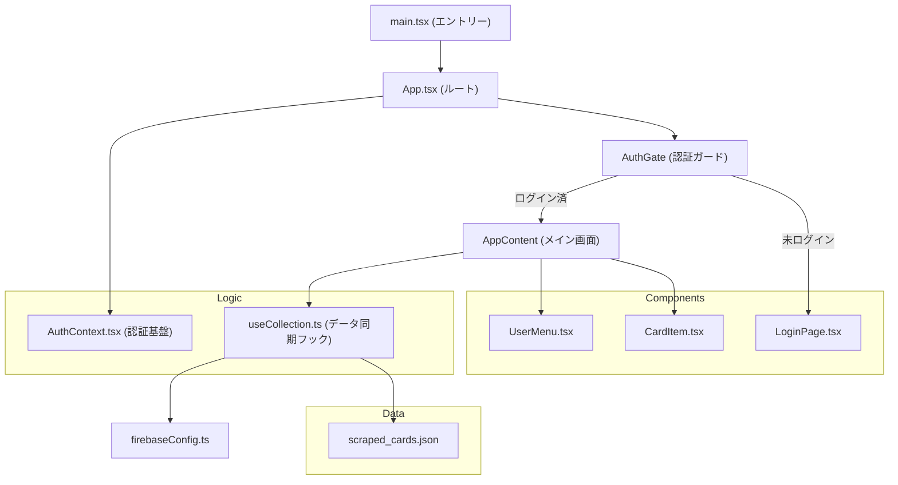

# マンホールカード・コレクター：アプリケーション解説ドキュメント

このドキュメントでは、`manhole-card-collector` プロジェクトのフロントエンドアプリケーションの構成、設計思想、および技術的な詳細について解説します。

---

## 1. 前提知識 (Prerequisite Knowledge)

本アプリケーションを理解するために必要な主要技術の概要です。

### React とは
React は、ユーザーインターフェース（UI）を構築するための JavaScript ライブラリです。以下の特徴があります：

*   **コンポーネントベース**: UI を「コンポーネント」という独立した再利用可能な部品に分割して管理します。
*   **宣言的 UI**: 「どう表示されるべきか」を記述するだけで、データの変更に合わせて React が効率的に表示を更新します。
*   **仮想 DOM**: 実際のブラウザの表示（DOM）を直接操作するのではなく、メモリ上の仮想的なコピーを操作することで、高速な描画を実現します。
*   **JSX**: JavaScript の中に HTML のような構文を記述できる形式です（例：`<div>Hello</div>`）。

### Vite と TypeScript
*   **Vite**: 超高速なビルドツール兼開発サーバーです。開発時の変更が即座にブラウザに反映されます。
*   **TypeScript**: JavaScript に「型」の概念を追加した言語です。コードの入力補完が強力になり、エラーを未然に防ぐことができます。

---

## 2. アプリケーションの全体像

このアプリは、全国のマンホールカードを管理・収集するためのコレクターツールです。
Firebase をバックエンドに利用し、リアルタイムでのデータ同期と Google 認証を提供しています。

### 技術スタック
*   **UI フレームワーク**: React 19
*   **スタイリング**: Tailwind CSS (ユーティリティファーストな CSS フレームワーク)
*   **アニメーション**: Framer Motion
*   **アイコン**: Lucide React
*   **バックエンド/認証**: Firebase (Auth, Firestore)

---

## 3. アーキテクチャと依存関係

アプリケーションの各ファイルがどのように関連し合っているかを以下の図に示します。




### 主要ファイルの役割
1.  **`main.tsx`**: アプリケーションの開始地点。React をブラウザの DOM に接続します。
2.  **`App.tsx`**: 全体のレイアウトと表示の切り替え（認証前/後の制御）を担当します。
3.  **`AuthContext.tsx`**: Firebase Auth をラップし、ログイン状態（誰がログインしているか）をアプリ全体で共有します。
4.  **`useCollection.ts`**: 最も重要なロジック。Firestore（クラウド）と localStorage（ブラウザ）の間で収集データを同期します。
5.  **`scraped_cards.json`**: アプリが表示する全てのカード情報のマスタデータです。

---

## 4. データフロー (How it works)

### 収集情報の同期プロセス
ユーザーがカードを「収集済み」にマークした際、以下の流れで処理が行われます：

1.  **UI 操作**: ユーザーが `CardItem` のチェックボタンをクリック。
2.  **楽観的更新**: `useCollection` が即座に画面上の状態を更新し、ユーザーに反応を返します。
3.  **条件分岐**:
    *   **ログイン済みの場合**: Firestore の `users/{uid}/data/collection` にデータを書き込みます。
    *   **未ログインの場合**: ブラウザの `localStorage` に保存します。
4.  **マイグレーション**: ユーザーが後からログインした場合、`localStorage` にあったデータが自動的にクラウド（Firestore）へ移行されます。

---

## 5. データ構造

マンホールカード 1 件あたりのデータ形式は以下の通りです（`src/types/card.ts` 参照）。

```typescript
export interface ManholeCard {
  id: string;        // ユニークID
  prefecture: string; // 都道府県
  city: string;       // 市区町村
  edition: string;    // 弾数 (例: 第23弾)
  imageUrl: string;   // カード画像のURL
  latitude: number;   // 設置場所の緯度
  longitude: number;  // 設置場所の経度
  // ...その他詳細
}
```

---

## 6. 開発と運用

データの追加や更新は、`scripts/` ディレクトリ内の Python スクリプトによって行われます。
公式サイトから新着情報をスクレイピングし、`src/data/scraped_cards.json` を更新することで、アプリに最新のカードが反映される仕組みになっています。
