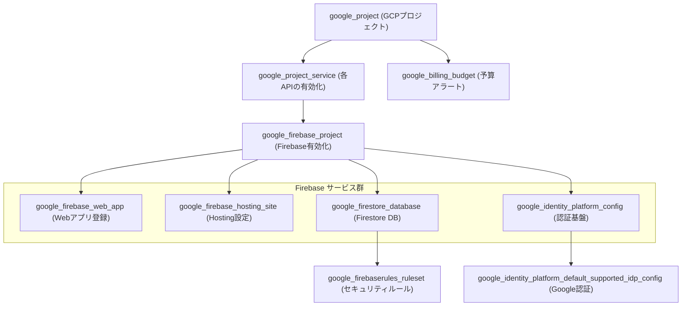

# マンホールカード・コレクター：インフラ構成（Terraform）解説ドキュメント

このドキュメントでは、`manhole-card-collector` プロジェクトのインフラ環境を管理する Terraform の構成、各リソースの役割、および運用方法について解説します。

---

## 1. 前提知識 (Infrastructure as Code)

### Terraform とは
Terraform は、クラウド上のインフラ構成（サーバー、データベース、ネットワーク等）をコード（HCL: HashiCorp Configuration Language）で定義し、自動的に構築・管理するためのツールです。

*   **宣言的記述**: 「最終的にどういう状態にしたいか」を記述するだけで、Terraform が現状との差分を計算し、必要な操作を自動実行します。
*   **State 管理**: 現在のインフラの状態を `terraform.tfstate` というファイルに記録し、管理の継続性を保ちます。
*   **再現性**: 同じコードを使用することで、誰でも、何度でも同じ環境を構築できます。

---

## 2. インフラ構成の全体像

本プロジェクトでは、GCP (Google Cloud Platform) 上に Firebase プロジェクトを構築し、フロントエンドのホスティングからバックエンド機能（認証・DB）までを一貫して管理しています。

### 構成リソース
*   **Google Cloud Project**: 全てのリソースの親コンテナ。
*   **Firebase Hosting**: Web アプリの公開サーバー。
*   **Firebase Authentication**: Google アカウント等による認証機能。
*   **Cloud Firestore**: 収集データ保存用の NoSQL データベース。
*   **Cloud Billing & Budget**: 予期せぬ課金を防ぐための予算管理。

---

## 3. リソース依存関係図

Terraform で定義されている各リソースの依存関係を可視化します。

---

## 4. 各ファイルの役割と詳細解説

### `main.tf`（中心となる定義）
主要なインフラロジックが記述されています：
*   **認証設定**: Identity Platform を使用して Google 認証を有効化します。
*   **セキュリティルール**: Firestore に対して「ログインユーザーが自分のデータのみ読み書き可能」という制約をコード上で定義しています。
*   **予算アラート**: 月額 1,000 円を上限とし、50% / 80% / 100% の到達時に通知が飛ぶよう設定されています。

### `variables.tf`（カスタマイズ用変数）
プロジェクト ID やリージョン、予算額などを外部から変更できるように定義されています。

### `outputs.tf`（実行結果の表示）
デプロイ完了後に表示される情報です：
*   **公開 URL**: ホスティング先の URL。
*   **Firebase Config**: フロントエンドの `.env` ファイルに転記すべき API キー等の設定値一式。

---

---

## 5. CI/CD との開発統合

本プロジェクトのインフラは、GitHub Actions による自動デプロイパイプラインと密接に連携しています。

### サービスアカウントと権限
GitHub Actions が Firebase Hosting へ安全にデプロイするために、最小権限の原則に基づいた専用の **Service Account** を Terraform もしくは Google Cloud コンソールで作成し、以下のシークレットを GitHub リポジトリに登録しています。

### 必要な GitHub Secrets
デプロイを正常に機能させるために、以下のシークレット（またはリポジトリ変数）の登録が必要です：
*   **`FIREBASE_SERVICE_ACCOUNT`**: Firebase デプロイ用サービスアカウントの JSON キー。
*   **`VITE_FIREBASE_API_KEY`** 等: フロントエンドのアプリ初期化に必要な構成情報（`terraform output -json` から取得可能）。

---

## 6. 運用と管理

### 基本的なワークフロー
1.  **初期化**: `terraform init` でプラグインをダウンロードします。
2.  **計画確認**: `terraform plan` で「どのリソースが作成・変更されるか」を事前に確認します。
3.  **反映**: `terraform apply` で実際のインフラを構築します。

### 注意事項
*   **機密情報**: `terraform.tfvars` には Billing Account ID などの機密情報が含まれるため、Git にはコミットしないでください。
*   **課金について**: 本構成は無料枠を最大限活用するよう設計されていますが、予算アラート（`google_billing_budget`）の設定により安全性を高めています。

